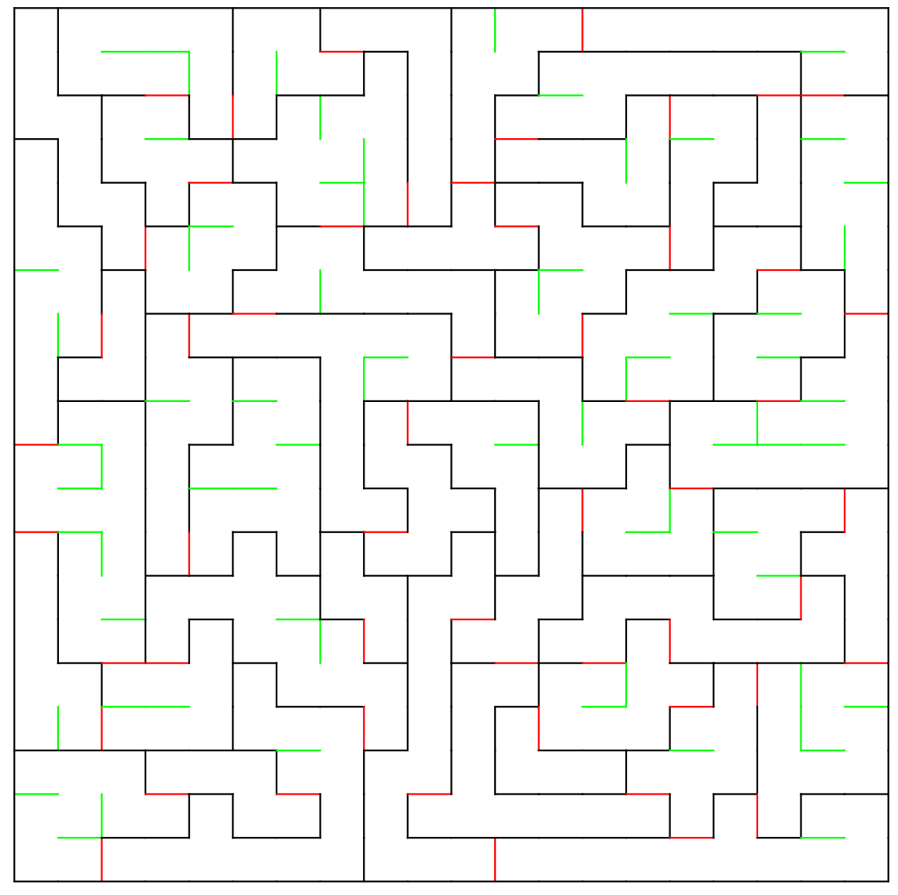

### Puzzle Creator

My son has always liked puzzles and I saw one in December 2019 that was more angular than the traditional shapes.  I was pretty sure that this would make the puzzle more challenging to put together but was not certain.

I wrote some software, captured here, to generate random puzzles and then used a 50W CO2 laser to cut out the resulting svg files. 

I'm happy with this software - it creates random puzzle images that interlock in a loose way and the optimization passes that I added really helped.  These optimizations include:

The general approach is as follows.  
1. Create a grid of width x height.  Initially each cell in the grid has walls on all four sides.
2.  Create a traditional maze where every node can reach every other node.  The walls created here form a basis for the walls in the pieces but if we cut this out then it would be one big piece with tons of 'interior' walls which are just cuts through the substrate but still resulting in a single piece.
3.  Create a depth first walk from the top left to every other node.  
4.  Take this walk and randomly add in walls along the walk.  Each wall added creates another piece as it breaks the "single large piece" into two parts.
	a.  We will not add a wall if it turns out that by adding the wall we would create a piece which is too small.  This happens when the DFS has to backtrack to a prior node due to a dead end.
5.  Perform the 'optimizations' of the pieces created so far.
	- Remove puzzle pieces that are 'too small'.  These are merged with their next smallest pieces that are adjacent to the one being considered.
	- Remove puzzle pieces which are just squares.  These aren't interesting enough IMO.
	- Break a 'too big' puzzle piece into two smaller pieces.  

An SVG for the grid is then outputed.  

Here is an example output in svg format:

In this image the black and red walls would be cut out (using whatever mechanism you chose) and the green walls are the interior walls and should be ignored.  
